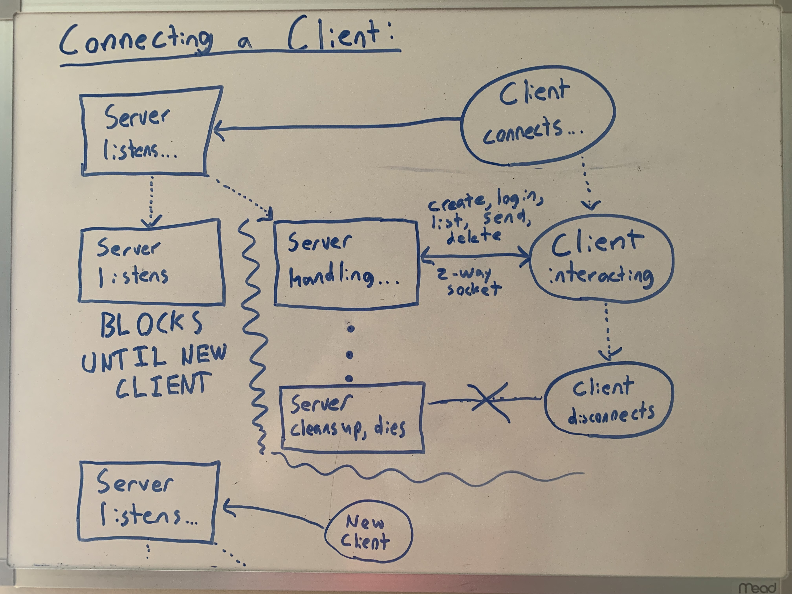
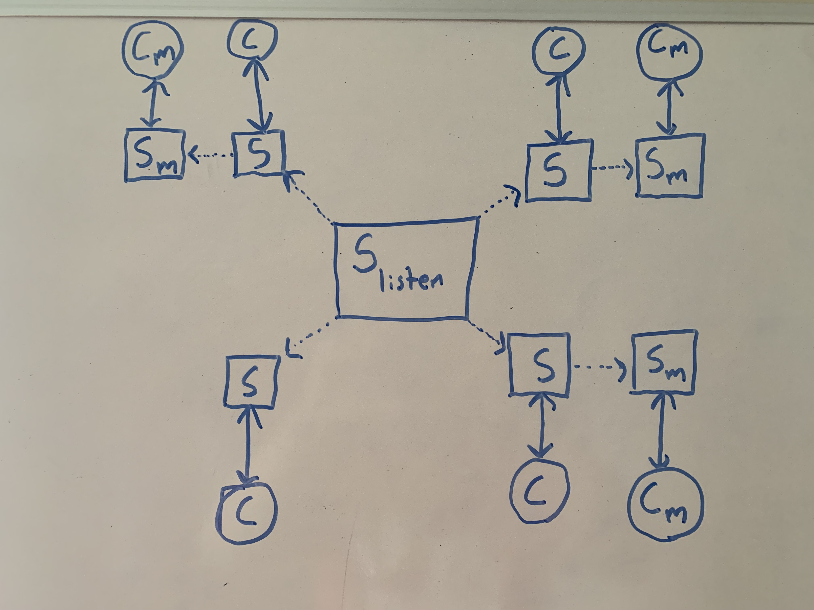

# Architecture

This document aims to give a (visual) snapshot of all the moving parts of the application, and justify the overall structure. Specifics can be found elsewhere.

## Client Server Connecting

First, the server begins listening for connections on a prescribed port. Then, a client connects to that host/port combination.

At that point, the server spins up a new thread and calls the `handle_connection` function to handle that connection. This connection is implemented by means of a two-way socket, and it lives exactly as long as the server remains active.

By creating a thread this way, we still have one main server thread that continues to listen to connections on the original host/port combination. This is needed to allow multiple simultaneous connections, while having the added simplicity on the client side of being able to treat their connection to the server as unique.

(Not pictured above) If for some reason the client attempts to connect but the server isn't listening - which can happen if you listen on the wrong host/port - the client will attempt to reconnect with exponential backoff. That is attempt to reconnect, wait 1 second, then 2 seconds, etc until the server is back up.

If during the execution of the client the server mysteriously crashes/dies, the client will also beginning attempting reconnection with exponential backoff. During this time no new commands can be entered, and the user must simply wait until the server is healthy again. NOTE: For simplicity, this also logs the user out. If the connection is re-established, the client will have to log back in again to continue.

## Client Authentication and Message Delivery

We want our app to be able to have instant delivery. That is, as soon as a message is sent, it is picked up by the client and printed.

It's not possible to do this on a single thread, because at any given time either the server will be blocked waiting for the client to write something, or the client will be blocked waiting for the server to write something. If a message came in, there's no good way to interrupt this process and deliver it.

The solution is to spin up a separate thread on both the client and server, with their own connection, that manage messages. In the diagram above, these new "watching" threads are pictured by Sm and Cm, and the original threads are S and C.

- S and C are agnostic of the watching thread. The establishment of this watching thread happens on login/create, which the client ensures only happens once per execution (Tto log out you kill both these threads.) In other words, the job of S and C is to continue to just run normal request-response commands. The client can ask to list accounts, or delete it's account, and always has an active, ready connection to the server.
- Sm and Cm are agnostic of the command thread (above). The job of Cm is repeatedly ask (poll) the server every 1 second for new messages. The job of Sm is to wait until asked for new messages, and then respond either yes (with the message) or no. NOTE: for part 2, the added simplicity of the wire protocl allowed us to extend this and implement a blocking instead of polling solution. That is, in part two instead of the client repeatedly asking for new messages, the client Cm thread sleeps and the Sm thread wakes it up preceisely when there is a new message. While this blocking approach might be slightly more efficient, both are correct and implement the specs in a reliable way for the expected use of this app.

## Birds-eye View at Scale

This is what the state of the app might look like when there are four connections. Note that one of the connections (bottom left) has not yet authenticated, and so it remains a single client/server connection. The other threads have authenticated, and each have two threads, one to manage commands and the other to watch for messages. The central server running in the center never dies, and remains listening for new connections.

## Concurrency

Since we allow multiple connections, we immediately must be concerned about concurrency. For instance, what happens if as one server thread is trying to list accounts, another server thread deletes a user? This is very bad.

Luckily, the state of this application is very simple. Global locks are bad, so instead we implement state-specific locks on the individual parts of this app that are relevant.

- A user lock. This lock must be obtained by any thread that wants to read, write, or delete to/from the users list.
- A messages lock. This lock must be obtained by any thread that wants to read, write, or delete to/from the messages dictionary.

The above picture shows how this system maintains concurrency. If there is one request that relies on coherent information about the state (in this case adding a new user), it obtains the lock. Then, another request on a different thread asks to get users. However, the first thread is not yet done adding the user, which may leave the app in a bad state. However, since we have the first thread (doing the add) acquire the lock, the second thread (doing the get) will wait until the first thread is done, and then get the lock for exclusive access to coherent information. All in all, it's a simple approach. It's not very well suited for large numbers of connections, but given this is a simple single-server app, it should be fine.

### How do we prevent deadlock / other issues?

- At no point in the application does any thread every own both the user lock and the messsages lock. This ensures that we never hit a state where two threads are deadlocked.
- At no point in the application does any thread do anything blocking while they own either lock. This ensures that we never have a thread that is sitting around waiting for something (that may never happen) while holding onto the lock.
- By using the python `with` syntax, we ensure that all locks are automatically released in the event of a client error, interrupt, explosion, or return.

These three conditions are enough to ensure that our threads do not hang forever.
